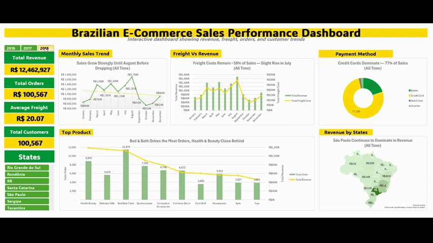
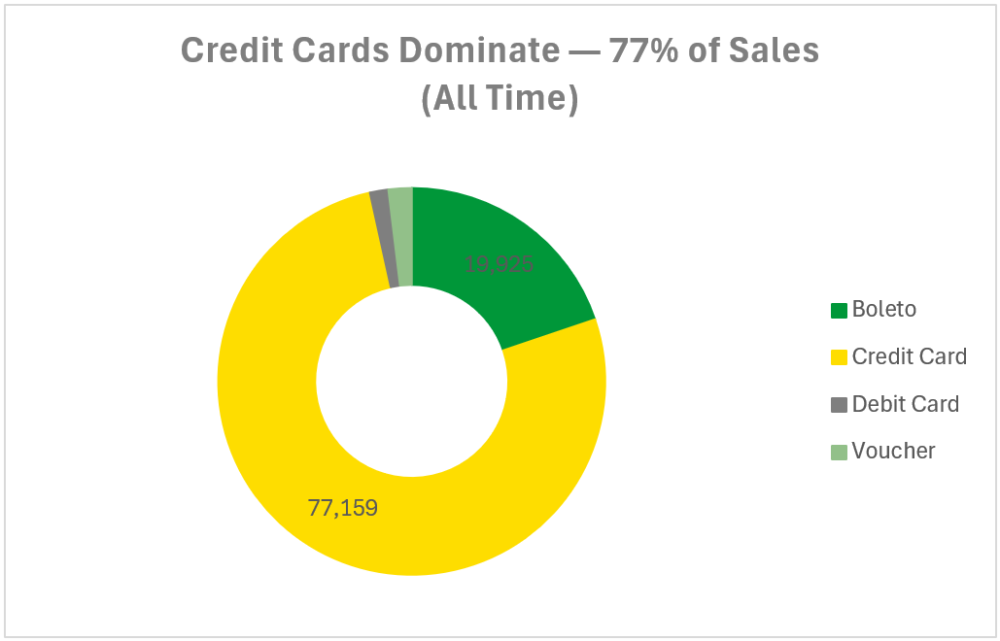
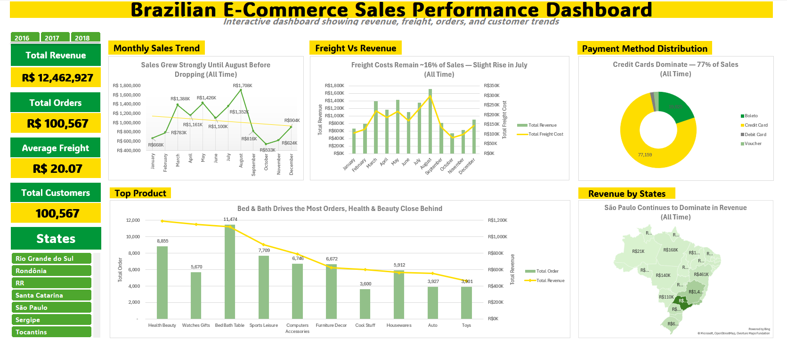

# Brazilian E-Commerce Sales Performance Dashboard

## 📌 Introduction

Dive into the world of **e-commerce analytics**! This project explores customer behavior, payment preferences, product performance, and freight costs using the **Brazilian E-Commerce Public Dataset (Olist)** [Dataset](https://www.kaggle.com/datasets/sudhanshukumar50480/cleaned-brazilian-ecommerce-data).

Using **SQL for data preparation** and **Excel for interactive dashboarding**, I created a performance overview that highlights key business insights and storytelling visuals.

## 📖 Background

The project was motivated by a need to **simulate a real business scenario**:

* How can we track sales and customer activity effectively?
* What drives revenue growth and customer satisfaction?
* Are freight costs impacting overall performance?

The dataset contains 100k+ orders across multiple dimensions (orders, customers, products, sellers, payments, reviews, and locations).

### The questions I wanted to answer through my SQL + Excel analysis were:

1. What are the top-performing product categories?
2. How do sales evolve over time?
3. How do freight costs compare to revenue?
4. Which payment methods** do customers prefer?
5. Which states generate the most sales?
6. How can we segment customers for better understanding?

---

## 🛠 Tools I Used

* **SQL (PostgreSQL):** Data extraction, cleaning, and transformation.
* **Excel:** PivotTables, slicers, and dashboard visualization.
* **OneDrive:** Version control and auto-backups after struggling with file loss. [Access to my project here](https://1drv.ms/x/c/2cb88e8d7640e7ce/ETfAO6uqa5xNumrYl6JaZE4BHM2Ch3KpOCNZrzeFNg-L5Q?e=oebDtH)
* **Git & GitHub:** Sharing scripts, queries, and project documentation.

---

## 📊 The Analysis

### 1. Top Product Categories

```sql
SELECT 
    EXTRACT(YEAR FROM order_purchase_timestamp) AS order_year,
    geolocation_state_customer AS customer_state,
    payment_type,
    product_category_name_english AS category,
    ROUND(SUM(price), 2) AS total_revenue,
    COUNT(DISTINCT order_id) AS total_orders
FROM
    brazilian_ecommerce_cleaned
WHERE
    order_status = 'delivered'
GROUP BY
    order_year, customer_state, payment_type, category
ORDER BY
    total_revenue DESC;
```

**🔑 Insights:**

* Bed & Bath, Health & Beauty, and Sports & Leisure dominate revenue.
* Consumer spending trends align with lifestyle and essential goods.


### 2. Monthly Sales Trend

```sql
SELECT
    EXTRACT(YEAR FROM order_purchase_timestamp) AS order_year,
    geolocation_state_customer AS customer_state,
    payment_type,
    EXTRACT(MONTH FROM order_purchase_timestamp) AS month_num,
    TO_CHAR(order_purchase_timestamp, 'Month') AS month_name,
    ROUND(SUM(price), 2) AS total_revenue,
    COUNT(DISTINCT order_id) AS num_orders
FROM
    brazilian_ecommerce_cleaned
WHERE
    order_status = 'delivered'
GROUP BY
    order_year, customer_state, payment_type, month_num, 
    month_name
ORDER BY
    order_year, month_num;
```

**🔑 Insights:**

* Sales peak in **mid-year (May–August)** before declining at year-end.
* Revenue growth is **seasonal**, not linked to freight cost changes.

---

### 3. Freight Cost vs Revenue

```sql
SELECT
    EXTRACT(YEAR FROM order_purchase_timestamp) AS order_year,
    geolocation_state_customer AS customer_state,
    payment_type,
    EXTRACT(MONTH FROM order_purchase_timestamp) AS month_num,
    TO_CHAR(order_purchase_timestamp, 'Month') AS month_name,
    ROUND(SUM(price), 2) AS total_revenue,
    ROUND(SUM(freight_value), 2) AS total_freight_cost,
    ROUND(SUM(freight_value) / NULLIF(SUM(price), 0) * 100, 2) AS 
    freight_to_revenue_pct
FROM
    brazilian_ecommerce_cleaned
WHERE
    order_status = 'delivered'
GROUP BY
    order_year, customer_state, payment_type, month_num, 
    month_name
ORDER BY
    order_year, month_num;
```

**🔑 Insights:**

* Freight costs remain **stable at \~15–18% of sales**.
* Freight doesn’t significantly reduce sales — demand is seasonal.

---

### 4. Payment Method Distribution

```sql
SELECT 
    EXTRACT(YEAR FROM order_purchase_timestamp) AS order_year,   
    geolocation_state_customer AS customer_state,                
    payment_type,                                                
    EXTRACT(MONTH FROM order_purchase_timestamp) AS month_num,
    TO_CHAR(order_purchase_timestamp, 'Month') AS month_name,
    ROUND(SUM(payment_value), 2) AS total_payment,
    COUNT(DISTINCT order_id) AS total_orders
FROM 
    brazilian_ecommerce_cleaned
WHERE 
    order_status = 'delivered'
GROUP BY 
    order_year, customer_state, payment_type, month_num,          
    month_name
ORDER BY 
    order_year, month_num, total_payment DESC;
```
**Insights:**

* **Credit cards dominate (77%)** of payments.
* Boleto, debit card, and vouchers make up smaller shares.

---

### 5. Sales by State

```sql
SELECT 
    geolocation_state_customer AS state,
    ROUND(SUM(price),2) AS total_revenue,
    COUNT(DISTINCT customer_unique_id) AS num_customers
FROM
    brazilian_ecommerce_cleaned
GROUP BY
    geolocation_state_customer
ORDER BY
    total_revenue DESC

```

**Insights:**

* **São Paulo** leads in revenue and orders.
* Revenue concentration highlights urban economic dominance.

---

### 6. Customer Segmentation

**Insights:**

* Most customers are **one-time buyers**.
* Opportunity: build loyalty programs to drive repeat purchases.
### 🧑‍🤝‍🧑 Customer Segmentation  

| Customer Type   | Number of Customers |
|-----------------|----------------------|
| Repeat Buyer    | 2,828               |
| One-time Buyer  | 90,860              |

---

## 📚 What I Learned

1. **SQL for Data Cleaning** → handling missing values, grouping, filtering delivered orders.
2. **Dashboard Design in Excel** → combining slicers, PivotTables, and charts for storytelling.
3. **Interactive Reporting** → connecting slicers across multiple PivotTables.
4. **File Management Discipline** → after redoing the dashboard 3 times, I adopted OneDrive for auto-backup and structured folders.
5. **Perseverance** → rebuilding from scratch tested me, but made me faster and sharper.

---

## 📝 Summary & Conclusions

* Sales are **seasonal** with a mid-year peak.
* Freight costs are **consistent** and don’t deter sales.
* Credit cards are the **preferred payment method**.
* São Paulo dominates revenue, showing the importance of urban regions.
* Most buyers are **one-time customers**, meaning retention is a growth opportunity.

✅ This project demonstrates my ability to move from **raw dataset → SQL analysis → interactive Excel dashboard** while overcoming technical and practical challenges. [My Full Project](https://1drv.ms/x/c/2cb88e8d7640e7ce/ETfAO6uqa5xNumrYl6JaZE4BHM2Ch3KpOCNZrzeFNg-L5Q?e=oebDtH)


